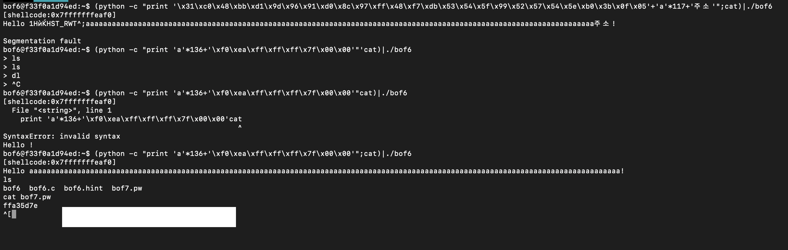

# bof3

innocent가 a가 되면 쉘코드가 실행되므로 쓰레기 값을 140개(buf크기)만큼 채워넣고 a를 넣어주면 쉘코드가 실행된다.

# bof4

innocent에 0x12345678이 들어가야하니 buf와 sfp를 쓰레기값으로 140개채운다음 위 16진수를 리틀앤디언방식으로 넣어주면 쉘코드가 실행이된다

# bof5

system(buf)라는 코드가 있으니 buf에 /bin/sh을 넣어줘서 이를 실행시키게 설계하면된다. innocent에는 bof4와 같이 리틀앤디언방식으로 키값을 넣어주도록하고 사이의 buf,sfp는 쓰레기값들로 채워주면 된다.

# bof6

쉘코드의 주소가 출력되는 함수가 있기에 코드를 실행시켜 쉘코드의 주소를 알아낸다음 buf와 sfp를 쓰레기값으로 채우고 ret에 쉘코드의 주소를 리틀앤디언방식으로 넣어주면된다.

# bof7

gets 가 아니라 strcpy로 buf를 채우므로 main함수의 인자로 몇바이트의 데이터가 들어가냐에 따라 buf의 시작주소가 달라지게 된다. 바이트수가 클수록 뒤로 밀리게 되는 것이다.그러므로 buf를 채우고 ret에 주소를 넣을정도의 바이트 즉144바이트만큼의 쓰레기값을 넣고 실행시켜 buf의 시작주소를 체크한다음 쉘코드+쓰레기값+buf의 시작주소로 페이로드를 구성하여 쉘코드가 실행되도록한다.

# bof8

SHELLCODE라는 환경변수를 참조하기에 환경변수에 많은 수의 nop와 쉘코드를 집어넣고 sfp와 buf를 쓰레기값으로 채운뒤 메모리보기를 통해서 확인한 주소를 참고차여 적당한 주소하나를 택하여 ret자리에 넣어주면 페이로드 구성이끝난다.